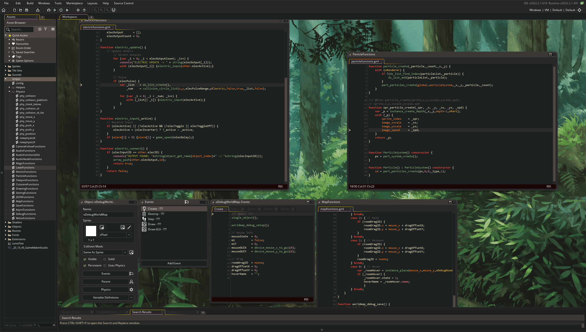

# Gruvbox for [GameMaker Studio](https://www.yoyogames.com/gamemaker)
> A retro groove skin for GameMaker

---

**CURRENTLY IN BETA!** 

Please open an [issue](https://github.com/heygleeson/gruvbox-gmtheme) if you notice something that does not look right. Currently doing my best to cover all aspects of the GameMaker IDE.

---

## Install
1. Download the [latest release]()
2. Navigate to `C:\ProgramData\GameMakerStudio2\Skins`
3. In GameMaker, navigate to `File > Preferences`, then `General Settings > IDE Skin > Gruvbox`, then click `Apply`.
4. Restart GameMaker.

## Troubleshooting

### Which version should I use?
> IDE version 2022.6 or later? `Gruvbox_GMSkin_BETA.zip`
> Using an older version? `Gruvbox_GMSkin_pre2022.6_BETA.zip`

At some point around mid-2022, YoYo updated how Skins work behind the scenes, by including a new `/Themes/` folder that contains all colour values for the skin in a single file, rather than listing them individually throughout dozens of `styles` files. This makes it easier to maintain skins in the future (and possibly make skin 'variants').

However, if you are not on the latest release of GameMaker, this is unsupported. Fortunately, I have made a `pre2022.6` version of this theme that should hopefully cover most previous releases. 

### Broken GUI/unsupported elements
YoYoGames are making drastic changes to the GameMaker IDE all the time and have not settled on a theme/skin specification. As a result, it is possible that some elements may break in future update. 

It's also entirely possible that I have missed something (it is a huge task to cover all aspects of the IDE).

If you notice something that sticks out, please open an [issue](https://github.com/heygleeson/gruvbox-gmtheme).

## Credit
- Background Image: "Forest Trail (The Wind Rises)" from Studio GHIBLI.
- Colours based on [gruvbox-base16](https://github.com/dawikur/base16-gruvbox-scheme)

## Thanks
- [isyourguy](https://github.com/isyourguy) & [krystal](https://github.com/krystalcoconut) for helping me with python to port the skin to older versions.
- [dracula/gamemaker-studio](https://github.com/dracula/gamemaker-studio) for being a main source of inspiration
- The original [gruvbox](https://github.com/morhetz/gruvbox) theme.

